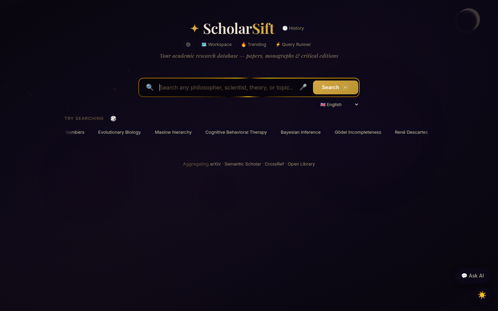

# ScholarSift

> A scholarly research dashboard with AI-powered search across 6 academic databases. Built with FastAPI + vanilla JS.

ScholarSift lets you search, visualize, organize, and export academic literature from arXiv, Semantic Scholar, CrossRef, OpenAlex, Open Library, and Google Books — all from a single clean dashboard.

---

## Screenshots

| Dashboard | Search Results | Topic Graph |
|-----------|---------------|-------------|
|  | <!--  --> | <!--  --> |

---

## Quick Start

### Prerequisites

- **Python 3.11+**
- Optional: an [OpenRouter](https://openrouter.ai/) or [OpenAI](https://platform.openai.com/) API key for AI features

### Local Setup

```bash
# 1. Clone the repository
git clone https://github.com/your-org/scholarsift.git
cd scholarsift

# 2. Create and activate a virtual environment
python3 -m venv venv
source venv/bin/activate

# 3. Install dependencies
pip install -r requirements.txt

# 4. (Optional) Configure API keys
cp .env.example .env
# Edit .env with your API keys

# 5. Run the server
python3 run_server.py
```

Open [http://localhost:8000](http://localhost:8000) in your browser.

### Docker Quick Start

```bash
# 1. Build and start with Docker Compose
docker compose up -d

# 2. Check the logs
docker compose logs -f

# 3. Open the dashboard
# http://localhost:8000
```

Set environment variables for AI features:
```bash
docker compose run -e OPENROUTER_API_KEY=sk-... -e OPENAI_API_KEY=sk-... scholarsift
```

Or create a `.env` file in the project root and Docker Compose will pick it up automatically.

---

## Features

### 🔍 Search
- **Multi-source search** — queries arXiv, Semantic Scholar, CrossRef, OpenAlex, Open Library, and Google Books simultaneously
- **Smart deduplication** — merges results from multiple sources, keeping the richest entry
- **Topic filtering** — auto-extracts topics from search results for drill-down refinement
- **Multi-language** — translate search queries to/from 10 languages (ES, FR, DE, ZH, JA, IT, PT, RU, KO)

### 🤖 AI & Context
- **AI Overviews** — LLM-generated topic summaries grounded in search results (supports OpenRouter / OpenAI)
- **Chat Assistant** — interactive research chat with context-aware responses
- **Paper Summarizer** — structured AI summaries (TLDR, key findings, methodology, limitations)
- **Smart fallback** — all AI features degrade gracefully when no API key is configured

### 📊 Visualization
- **Topic Graph** — interactive force-directed graph of research topics and keywords (via OpenAlex concepts + keyword extraction)
- **Co-Author Network** — explore an author's collaboration network from OpenAlex
- **Research Timeline** — papers grouped by year with citation bar charts
- **Trending Feed** — latest arXiv papers in AI/NLP/ML, updated in real-time

### 📁 Organization
- **Bookmarks** — save papers for later (synced to the cloud)
- **Collections** — group papers into themed collections
- **Research Workspace** — visual canvas to map research ideas
- **Real-time Collaboration** — WebSocket-powered multi-user collections editing

### 📄 Export
- **PDF Reports** — generate polished academic-style PDF exports of any search
- **Citation Chains** — explore paper references and citations via Semantic Scholar

### 🎨 UX
- **Wikipedia sidekick** — inline Wikipedia summaries for context
- **Paper Details** — deep-dive panel with TLDR, references, citation count, open-access PDF links
- **PWA-ready** — installable as a Progressive Web App with offline service worker
- **Responsive** — works on desktop and mobile

### 🌌 Visual
- Animated galaxy background
- Dark theme by default
- Smooth transitions and micro-interactions

### 🐳 Deploy
- **Docker** — production-ready multi-stage Dockerfile with health checks
- **Docker Compose** — one-command deployment with env config and volume persistence
- **Non-root** — container runs as `scholarsift` user for security

---

## API Reference

| Endpoint | Method | Description | Query Params |
|----------|--------|-------------|--------------|
| `/api/health` | GET | Health check | — |
| `/api/search` | GET | Search across all sources | `q` (required), `topic`, `max_results` (1–50) |
| `/api/wiki` | GET | Wikipedia summary lookup | `q` (required) |
| `/api/trending` | GET | Trending papers from arXiv | `max_results` (1–50) |
| `/api/timeline` | GET | Results grouped by year | `q` (required) |
| `/api/topic-graph` | GET | Topic relationship graph | `q` (required) |
| `/api/coauthor-graph` | GET | Co-author network | `author` (required) |
| `/api/ai-overview` | GET | LLM-generated topic summary | `q` (required) |
| `/api/paper-details` | GET | Deep paper info from Semantic Scholar | `url` or `arxiv_id` |
| `/api/chat` | POST | Chat with research assistant | JSON body |
| `/api/summarize-paper` | POST | Structured paper summary | JSON body |
| `/api/translate` | GET | Translate search query | `text`, `target` (lang code) |
| `/api/export-pdf` | GET | Generate PDF of results | `q`, `results_json` |
| `/api/auth/register` | POST | Register a new user | JSON: `username`, `password` |
| `/api/auth/login` | POST | Login | JSON: `username`, `password` |
| `/api/auth/me` | GET | Get current user info | `Authorization: Bearer <token>` |
| `/api/sync/bookmarks` | GET/POST | Sync bookmarks (auth required) | JSON body or `token` query |
| `/api/sync/collections` | GET/POST | Sync collections (auth required) | JSON body or `token` query |
| `/api/workspace` | GET/POST | Save/load research workspace | `token` query or JSON body |
| `/api/openalex/works/{id}` | GET | OpenAlex work details | Path param: work ID |
| `/ws` | WebSocket | Real-time collaboration | Join message with `room` + `token` |

---

## Configuration

ScholarSift is configured via environment variables:

| Variable | Default | Required | Description |
|----------|---------|----------|-------------|
| `OPENROUTER_API_KEY` | — | No* | OpenRouter API key for AI features |
| `OPENAI_API_KEY` | — | No* | OpenAI API key (alternative to OpenRouter) |
| `CHAT_MODEL` | `deepseek/deepseek-chat` | No | Model for chat assistant |
| `OVERVIEW_MODEL` | `deepseek/deepseek-chat` | No | Model for overviews, summaries, translation |
| `OPENAI_BASE_URL` | `https://openrouter.ai/api/v1` | No | Custom OpenAI-compatible endpoint |

*\*At least one API key is required for AI-powered features. All other functionality works without one.*

---

## Project Structure

```
scholarsift/
├── scholarsift.db              # SQLite database (auto-created)
├── schema.sql                  # Database schema
├── main.py                     # FastAPI application (routes, endpoints)
├── run_server.py               # Dev server runner
├── requirements.txt            # Python dependencies
├── Dockerfile                  # Production Docker build
├── docker-compose.yml          # Docker Compose config
├── .env.example                # Environment variable template
├── pytest.ini                  # Pytest configuration
├── tests/                      # Test suite
│   ├── __init__.py
│   ├── conftest.py             # Pytest fixtures
│   └── test_api.py             # API tests (13 tests)
├── scholarly_app/              # Python package
│   ├── __init__.py
│   ├── main.py                 # (same as ../main.py — module import)
│   ├── auth.py                 # JWT-like token auth
│   ├── search_providers.py     # Multi-source search logic
│   └── topic_extractor.py      # AI topic extraction
└── static/                     # Frontend (vanilla JS)
    ├── index.html              # Main SPA
    ├── app.js                  # Application logic
    ├── style.css               # Styles
    ├── galaxy-bg.css           # Animated background
    ├── manifest.json           # PWA manifest
    └── sw.js                   # Service worker
```

---

## Browser Extension Integration

ScholarSift can synchronize with a browser extension (see `browser-extension/` subdirectory). The extension captures papers you visit and syncs them to your ScholarSift account via the `/api/sync/bookmarks` and `/api/sync/collections` endpoints.

### Extension Features
- One-click bookmarking of papers from any source
- Collection management with drag-and-drop
- Tag and annotate papers
- Sync to cloud, access from any device

### Setup
1. Build the extension: `cd browser-extension && npm install && npm run build`
2. Load the unpacked extension from `browser-extension/dist/` into your browser
3. Configure the ScholarSift server URL in extension settings

---

## Testing

```bash
# Install test dependencies
pip install pytest pytest-asyncio httpx

# Run the test suite
pytest tests/ -v

# Run with coverage
pip install pytest-cov
pytest tests/ --cov=scholarly_app --cov-report=term-missing
```

The test suite covers:
- Health check endpoint
- Search across multiple sources
- Wikipedia lookups (known + unknown topics)
- Trending papers feed
- Research timeline
- Topic graph generation
- Co-author network graph
- User registration and login (including wrong-password rejection)
- Paper details from Semantic Scholar

---

## Contributing

1. **Fork** the repository
2. **Create a feature branch** — `git checkout -b feat/amazing-feature`
3. **Make your changes**
4. **Write tests** for any new functionality
5. **Run the tests** — `pytest tests/ -v` (all must pass)
6. **Commit** — `git commit -m "feat: add amazing feature"`
7. **Push** — `git push origin feat/amazing-feature`
8. **Open a Pull Request**

### Code Style
- Python: follow PEP 8 (use `black` and `ruff`)
- JavaScript: follow standard JS conventions
- Keep the Dockerfile and docker-compose.yml in sync with any new dependencies
- Add environment variables to `.env.example` when introducing new config

---

## License

MIT License — see the [LICENSE](LICENSE) file for details.
